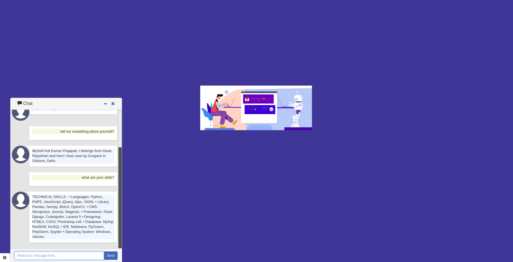

# Django & jQuery MyResume-BOT Chat Application
A simple MyResume chatbot build with Django, Jquery & chatbotAI.

## Installation

Installation is simplest:

1. Clone the repository
2. Install dependencies with `pip install -r requirements.txt`

#### Installation notes

MyResume-BOT depends on:
 1. `Django`
 2. `chatbotAI`

## What He Can Tell You.

- You can ask him about anything related to my resume.
- You can ask him about software development tools and terminologies.
- You can ask him to show recent questions posted on stackoverflow for specific tag
- You can ask him to display recent answered questions posted on stackoverflow for specific tag
- Specify the no. of questions or he will get 5 results.
- He provide you Chat Summary too when the chat ends.

## Demo link


```
python bot.py
```

output is:



## Author

* **Anil Kumar Prajapati** 
